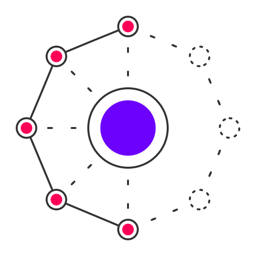

  

# Entourage

Environment bootstrapping for integration tests

## Architecture

This project has 2 components that work together, a server and a client component.

Typically one server runs to manage multiple projects and respective versions of each project. Each CI pipeline uses then the client to init/access/destroy a profile on the server.

The server needs to run as a privileged docker container.  
Check package details page of [entourage-server](https://github.com/chriskalmar/entourage/tree/master/packages/entourage-server) for more details.

The client configuration is part of the repo that runs the integration tests later.  
Check package details page of [entourage-cli](https://github.com/chriskalmar/entourage/tree/master/packages/entourage-cli) for more details.

## TODOs

- [ ] provide functionality to run health checks
- [ ] implement container clean-up process (garbage collection)
- [ ] lock versions
- [ ] persist server registry in redis ?
